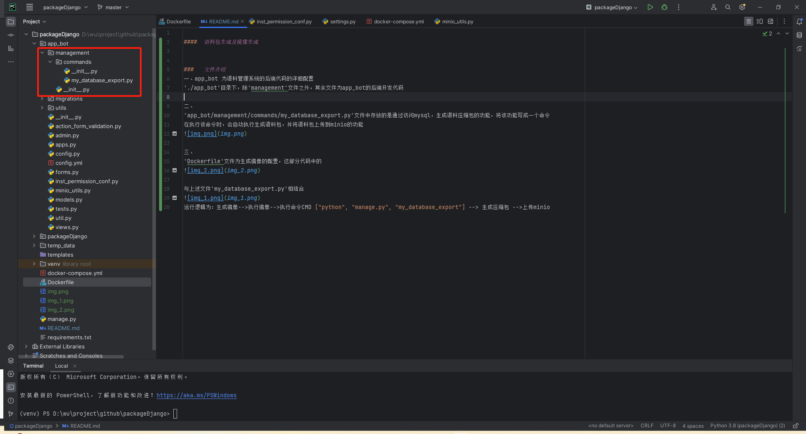
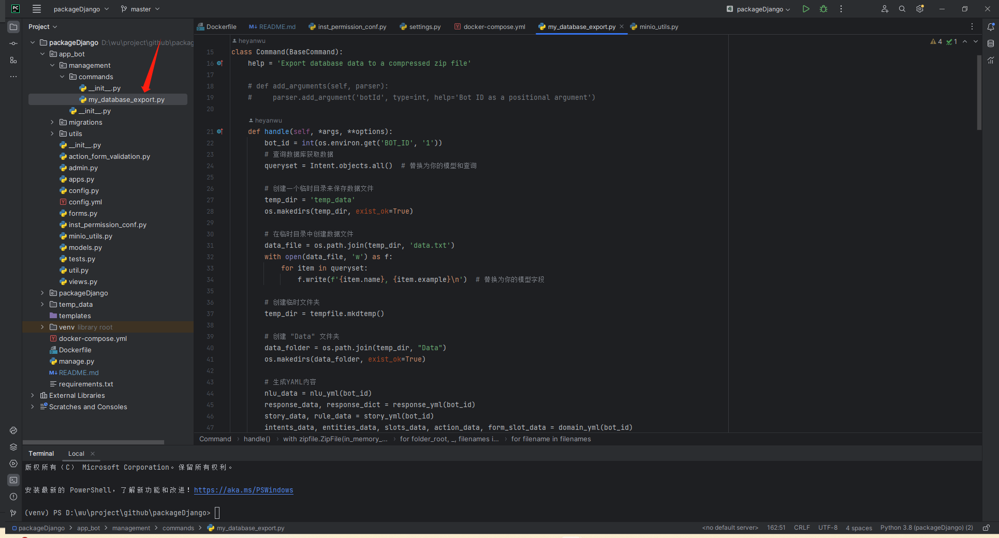
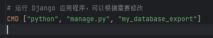
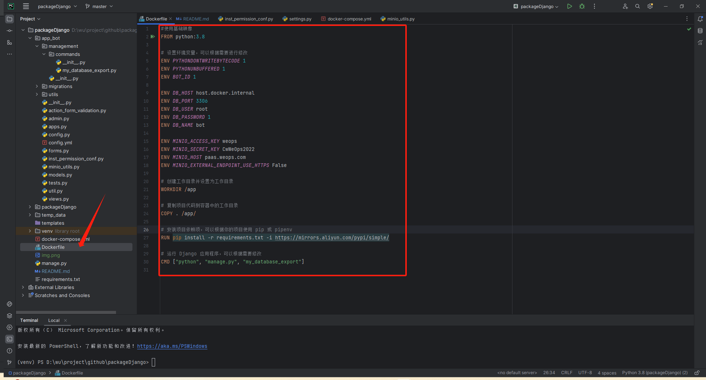

####  语料包生成及镜像生成

###   文件介绍
一、app_bot 为语料管理系统的后端代码的详细配置
'./app_bot'目录下，除'management'文件之外，其余文件为app_bot的后端开发代码

二、
'app_bot/management/commands/my_database_export.py'文件中存放的是通过访问mysql，生成语料压缩包的功能，将该功能写成一个命令
在执行该命令时，会自动执行生成语料包，并将语料包上传到minio的功能

三、
'Dockerfile'文件为生成镜像的配置，这部分代码中的

与上述文件'my_database_export.py'相结合

运行逻辑为：生成镜像-->执行镜像-->执行命令CMD ["python", "manage.py", "my_database_export"] --> 生成压缩包 -->上传minio